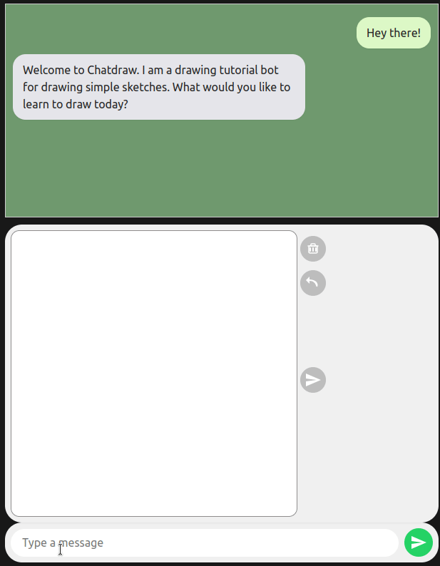

ChatDraw - You AI guide for drawing simple sketches
===================================================
### simple sketch drawing tutorials for whatever is on your mind
ChatDraw is a chatbot application that teaches users to draw simple sketches step-by-step. 
It generates drawing tutorials based on the concept the user provides, 
guides users through each stroke, and provides feedback for each step. 

Quick Start
============
For quickly running the drawing chat service on your machine: 
1. Install [docker compose](https://docs.docker.com/compose/install/)
2. Get an [Anthropic](console.anthropic.com) API key and add it to your 
 environment variables using:
 ```bash
 export ANTHROPIC_API_KEY=<your key>
 ``` 
 Add this line to ~/.profile for persistance 

3. Download the [docker compose yaml](https://raw.githubusercontent.com/barboym/chatdraw/main/docker-compose.yml) from the repo and run it:
```bash
wget https://raw.githubusercontent.com/barboym/chatdraw/main/docker-compose.yml 
docker compose up -d
```
The site should be available on localhost:8010. 

Features
=============


- AI-generated sketch tutorials
- Step-by-step drawing guidance
- Drawing feedback and scoring
- FastAPI 
- PostgreSQL database integration


Project Structure
==================
draw_service/ - core package with chat flows and sketch logic  
frontend/ - vite project

Author 
===========
Moshe Barboy
